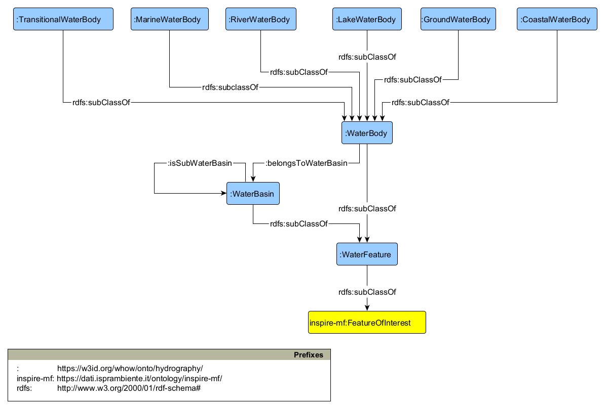

# WO - WHOW Ontology

The **WHOW** models concepts and relations describing water quality monitoring and water consumption on healththe using standard Ontology modelling language [OWL - Web Ontology Language](https://www.w3.org/Submission/owl11-overview/).

<! ---

**Base URI:** `https://w3id.org/whow/onto/whow-ontology`

**Namespace Prefix:** `wo`

--->

#### Overview

* [Ontology Model overview](#model-overview)
* [Usage example](#model-instances)
* [Resources](#model-resources)

### Ontology Model overview: modules

### [Hydrography ontology](https://raw.githubusercontent.com/whow-project/ontology-network/main/whow-ontology-network/hydrography-ontology.ttl)

The Hydrography ontology module represents a taxonomy of water bodies and the relationship between them, drawing from existing international taxonomies and standards.

### [Water monitoring ontology](https://raw.githubusercontent.com/whow-project/ontology-network/main/whow-ontology-network/water-monitoring-ontology.ttl)

The Water monitoring ontology module is an extension of the SOSA/SSN ontology for the water domain: it contributes to the water quality observational monitoring process, allowing to relate taxonomies derived from European Directives of parameters observed in water features with domain-specific value bounds and measurement units, along with monitoring facilities.

### [Water indicators ontology](https://raw.githubusercontent.com/whow-project/ontology-network/main/whow-ontology-network/water-indicators-ontology.ttl)

The Water indicators ontology module is an extension of the Indicator ontology but specialized for specific indexes and indicators of quality of waters.

### [Health monitoring ontology](https://raw.githubusercontent.com/whow-project/ontology-network/main/whow-ontology-network/health-monitoring-ontology.ttl)

The Health monitoring ontology module aims to represent health observations with a specific focus on infectious diseases.

### Ontology Model usage: instances diagrams

### [Hydrography ontology](https://raw.githubusercontent.com/whow-project/ontology-network/main/whow-ontology-network/hydrography-ontology.ttl)

### [Water monitoring ontology](https://raw.githubusercontent.com/whow-project/ontology-network/main/whow-ontology-network/water-monitoring-ontology.ttl)

### [Water indicators ontology](https://raw.githubusercontent.com/whow-project/ontology-network/main/whow-ontology-network/water-indicators-ontology.ttl)

### [Health monitoring ontology](https://raw.githubusercontent.com/whow-project/ontology-network/main/whow-ontology-network/health-monitoring-ontology.ttl)

### Ontology Model overview: resources

Here are linked publications and other resources about the developed ontology modules.

