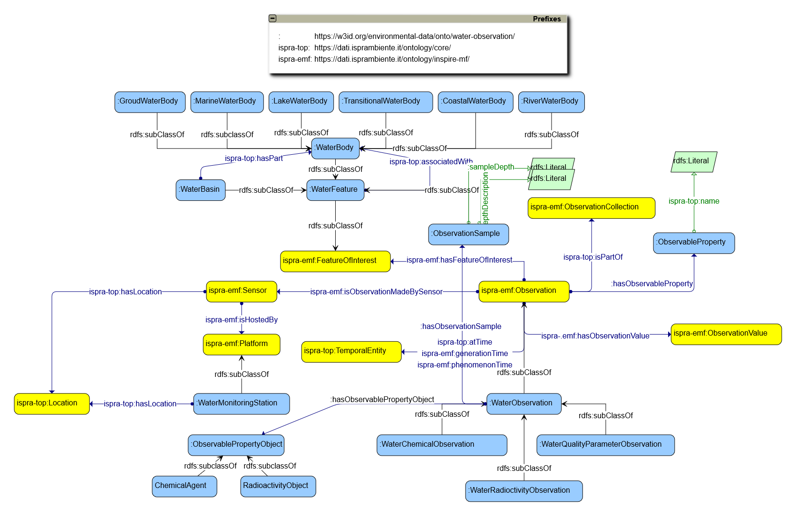

# WO - WHOW Ontology

The **WHOW** models concepts and relations describing water quality monitoring and water consumption on healththe using standard Ontology modelling language [OWL - Web Ontology Language](https://www.w3.org/Submission/owl11-overview/).

**Base URI:** `https://whowproject.eu/ontologies/whow-ontology/`

**Namespace Prefix:** `wo`


#### Overview

* [Ontology Model overview](#model-overview)


### <a name="model-overview"></a>Ontology Model overview



**Figure 1.** The diagram below shows the class structure of the WO ontology. 

The following triples express, for example, an istance of WaterObservation:

```turtle
      ===> qui esempio di istanza in RDF
```

where `ex` is a prefixes for another namespace.

The RDF structure for this example shows as follows:


**Figure 2.** An RDF diagram representing a Lake Water Observation instance 

Please not that:

> Some note here....

